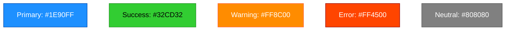

# 📊 Diagram Standards Framework

> **Scope:** Unified diagram standards for all projects using this framework
> **Apply To:** All agents generating diagrams (SA, SD)
> **Status:** Active
> **Framework:** Generic - reusable across all projects

---

## 🎯 Core Principle

**All diagrams must be embedded directly in output documents**, using a unified standard format.

- ✅ Diagrams live in agent output markdown files (not separate folders)
- ✅ All diagrams use Mermaid.js format
- ✅ Consistent naming conventions across all projects
- ✅ Standard color scheme for visual consistency
- ❌ No separate `/diagrams/` folder
- ❌ No external image files

---

## 📐 Supported Diagram Types

| Type | Format | Mermaid Syntax | Used By | Purpose |
|------|--------|---|----------|---------|
| **Architecture** | Diagram | `graph TD` / `graph LR` | SD | System component layout |
| **Sequence/Flow** | Diagram | `sequenceDiagram` | SA | User interaction flows |
| **Data Model** | Diagram | `erDiagram` | SD | Entity relationships |
| **State Lifecycle** | Diagram | `stateDiagram-v2` | SA/SD | Entity state transitions |
| **Process Flow** | Diagram | `flowchart TD` | SA | Workflow steps |
| **Deployment** | Diagram | `graph TD` | SD | Infrastructure setup |
| **Component** | Diagram | `graph TD` with styling | SD | Component relationships |

---

## 🎨 Standard Styling

### Color Scheme (Mermaid classDef)



### Typography Rules

- **Node Labels:** Max 30 characters, concise descriptions
- **Icons:** Use emoji where appropriate (🖥️, 🗄️, 🔌, etc.)
- **Direction:** `TD` (top-down) for hierarchies, `LR` (left-right) for processes
- **Spacing:** Visual separation for readability

---

## 📋 Naming Conventions

**Standard Format:** `[TYPE]-[Context]-[Purpose].md`

| Diagram Type | Naming Pattern | Example |
|---|---|---|
| **Architecture** | `ARCHITECTURE-[Component]` | `ARCHITECTURE-Auth-System.md` |
| **Component** | `COMPONENT-[Name]` | `COMPONENT-UserAuthentication.md` |
| **Sequence/Flow** | `FLOW-[Process]-Sequence` | `FLOW-UserLogin-Sequence.md` |
| **State** | `STATE-[Entity]-Lifecycle` | `STATE-Task-Lifecycle.md` |
| **Process** | `PROCESS-[Name]-Flow` | `PROCESS-TaskCreation-Flow.md` |
| **Data Model** | `SCHEMA-[Relationship]` | `SCHEMA-UserTaskRelationship.md` |
| **Deployment** | `DEPLOYMENT-[Environment]` | `DEPLOYMENT-Production-AWS.md` |

---

## 🏗️ Embedding Pattern

### In Markdown Documents

All diagrams are embedded as Mermaid code blocks within documentation:

```markdown
# Document Title

## Overview
[Descriptive text]

## Diagram Section
\`\`\`mermaid
graph TD
    [Mermaid code here]
\`\`\`

## Related Information
[More context]
```

### File Locations

**SA Agent Output (Analysis Documents):**
- Sequence diagrams in: `docs/analysis/requirements/`
- Flow diagrams in: `docs/analysis/system-analysis/`
- State diagrams in: `docs/analysis/system-analysis/`

**SD Agent Output (Design Documents):**
- Architecture diagrams in: `docs/design/architecture/`
- Component diagrams in: `docs/design/components/`
- Data model diagrams in: `docs/design/database/`
- Deployment diagrams in: `docs/design/architecture/`

---

## ✅ Quality Checklist

Before finalizing any diagram:

- [ ] Diagram type matches content purpose
- [ ] All labels are clear and concise (≤30 chars)
- [ ] Mermaid syntax is valid (no rendering errors)
- [ ] Color scheme follows standard definitions
- [ ] Embedded in markdown document (not separate file)
- [ ] Naming follows convention: `[TYPE]-[Context].md`
- [ ] Diagram has surrounding context/explanation

---

## 🔄 Tool Setup

**Recommended VS Code Extensions:**
- "Markdown Preview Mermaid Support" - Preview diagrams while editing
- "Mermaid Markdown Syntax Highlight" - Syntax highlighting

**For Local Testing:**
```bash
npm install -g mermaid-cli
mmdc -i document.md -o document.png
```

---

## 📚 References

- [Mermaid.js Documentation](https://mermaid.js.org/)
- [Supported Diagram Types](https://mermaid.js.org/syntax/diagram-types/index.html)
- [Configuration & Styling](https://mermaid.js.org/config/setup/README.html)

---

## Version History

| Version | Date | Changes |
|---------|------|---------|
| v1 | 2026-05-06 | Initial framework definition |
