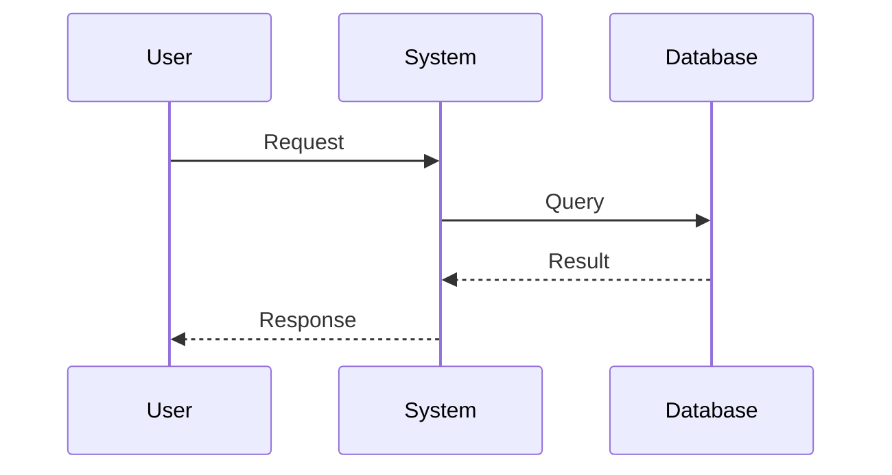
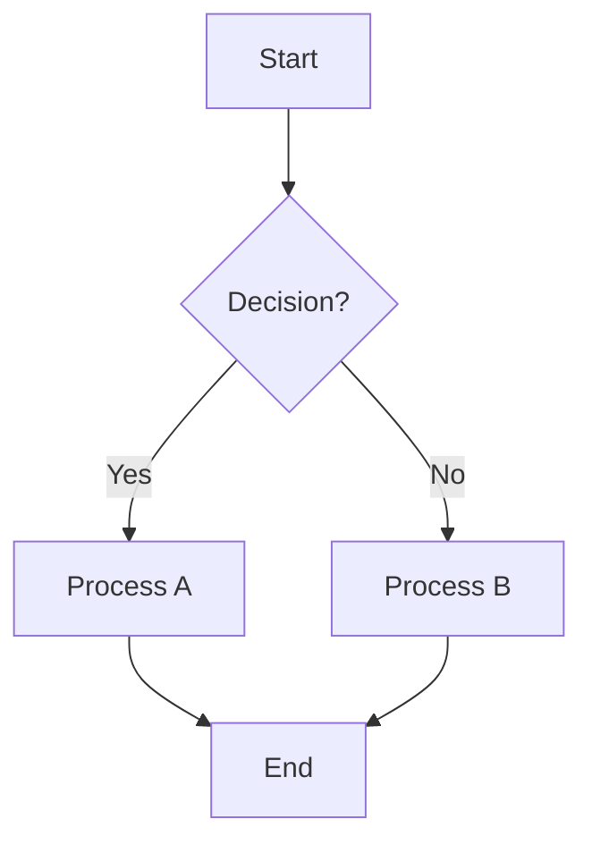
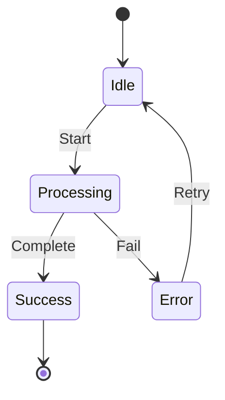
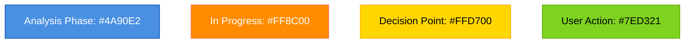
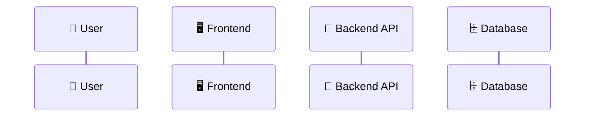

# 📊 Diagram Standards for SA Agent Output

> **Scope:** Diagram specifications for System Analysis (SA) agent outputs
> **Apply To:** SA agent when generating analysis documents
> **Status:** Active
> **Extends:** `.github/skills/reference/assets/DIAGRAM-STANDARDS.md`

---

## 🎯 SA Diagram Focus

The SA agent generates diagrams for **requirements analysis and system behavior documentation**.

---

## 📐 Supported Diagram Types (SA)

### 1. **Sequence Diagrams** (Primary)

**Purpose:** Document user interactions, system flows, and message sequences

**Mermaid Format:**


**Naming:** `FLOW-[ProcessName]-Sequence.md`

**Embedding Location:** `docs/analysis/requirements/`

**Example Use Cases:**
- User login flow
- Payment processing
- Data synchronization
- Error handling

---

### 2. **Process Flow Diagrams** (Secondary)

**Purpose:** Document workflows, decision trees, and business processes

**Mermaid Format:**


**Naming:** `PROCESS-[WorkflowName]-Flow.md`

**Embedding Location:** `docs/analysis/system-analysis/`

**Example Use Cases:**
- Task creation workflow
- Approval processes
- Data validation steps
- Integration workflows

---

### 3. **State Transition Diagrams** (Supporting)

**Purpose:** Document entity lifecycle, status transitions, and state machines

**Mermaid Format:**


**Naming:** `STATE-[Entity]-Lifecycle.md`

**Embedding Location:** `docs/analysis/system-analysis/`

**Example Use Cases:**
- Task status lifecycle (Created → In Progress → Completed)
- User states (Pending → Active → Suspended)
- Order processing states

---

## 🎨 SA-Specific Styling

### Color Conventions



### Actor/Entity Styling



---

## 📋 Template: SA Document with Diagrams

```markdown
# Analysis: [Feature/Process Name]

## Overview
[Description of requirements]

## User Interaction Flow

\`\`\`mermaid
sequenceDiagram
    [Sequence diagram here]
\`\`\`

## Process Steps

\`\`\`mermaid
flowchart TD
    [Process flow diagram here]
\`\`\`

## Status Lifecycle

\`\`\`mermaid
stateDiagram-v2
    [State transitions here]
\`\`\`

## Functional Requirements
[Requirements listed]

## Non-Functional Requirements
[NFR specifications]
```

---

## ✅ SA Diagram Checklist

Before finalizing SA diagrams:

- [ ] All user interactions are documented
- [ ] Edge cases and error scenarios included
- [ ] Actor roles clearly identified (👤, 🖥️, 🔌, etc.)
- [ ] Message sequences are accurate and complete
- [ ] Decision points clearly shown with conditions
- [ ] State transitions cover all scenarios
- [ ] Diagram is embedded in markdown (not separate)
- [ ] Following SA naming convention
- [ ] Located in `docs/analysis/` folder

---

## 📚 Related

- [Framework: Diagram Standards](../reference/assets/DIAGRAM-STANDARDS.md)
- [SA Skill](../SKILL.md)
- [Output Location](../../../docs/analysis/)

---

## Version History

| Version | Date | Changes |
|---------|------|---------|
| v1 | 2026-05-06 | Initial SA diagram specifications |
