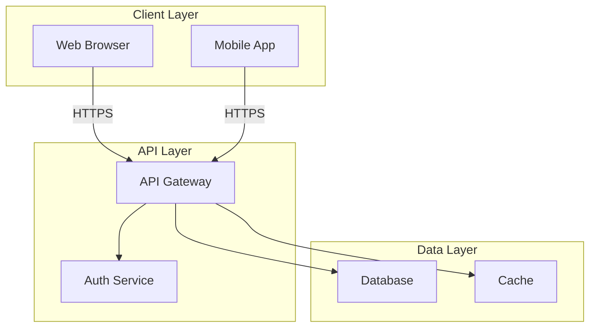
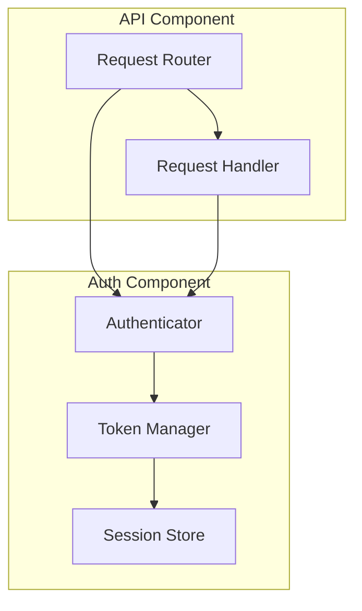
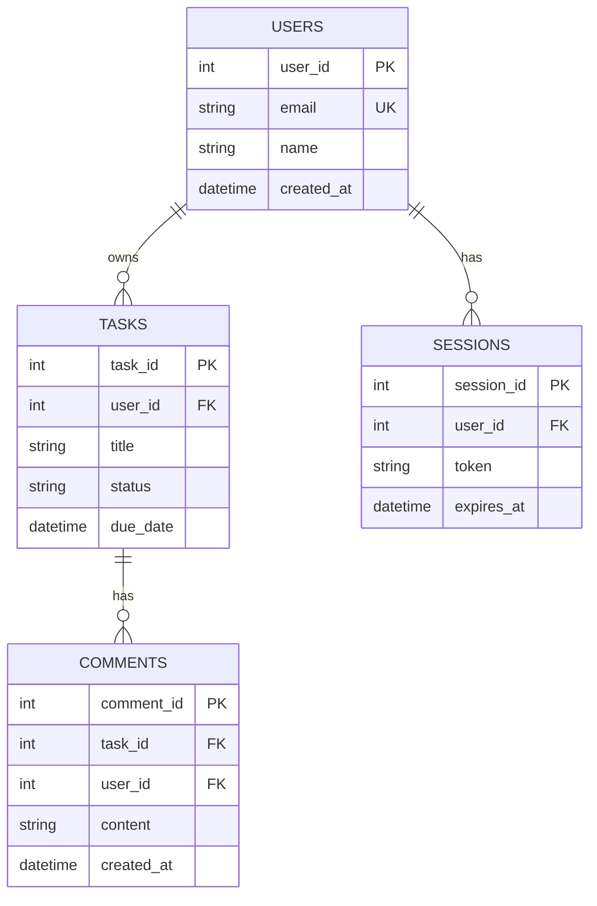
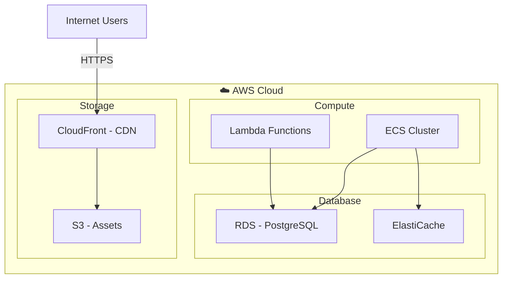
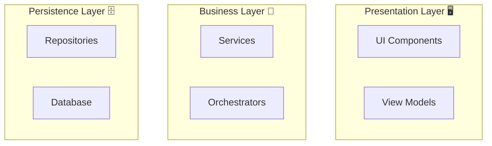

# 📊 Diagram Standards for SD Agent Output

> **Scope:** Diagram specifications for System Design (SD) agent outputs
> **Apply To:** SD agent when generating design documents
> **Status:** Active
> **Extends:** `.github/skills/reference/assets/DIAGRAM-STANDARDS.md`

---

## 🎯 SD Diagram Focus

The SD agent generates diagrams for **technical architecture, component design, data models, and system infrastructure**.

---

## 📐 Supported Diagram Types (SD)

### 1. **Architecture Diagrams** (Primary)

**Purpose:** High-level system architecture and component relationships

**Mermaid Format:**


**Naming:** `ARCHITECTURE-[ComponentName].md`

**Embedding Location:** `docs/design/architecture/`

**Example Use Cases:**
- System architecture overview
- Layer architecture (presentation, business, data)
- Microservices architecture
- Cloud infrastructure layout

---

### 2. **Component Diagrams** (Secondary)

**Purpose:** Detailed component structure and dependencies within a system

**Mermaid Format:**


**Naming:** `COMPONENT-[ComponentName].md`

**Embedding Location:** `docs/design/components/`

**Example Use Cases:**
- Authentication system components
- Data processing pipeline
- Message queue components
- Service orchestration

---

### 3. **Data Model / ER Diagrams** (Primary)

**Purpose:** Database schema, entity relationships, and data structures

**Mermaid Format:**


**Naming:** `SCHEMA-[EntityName].md` or `SCHEMA-[Context]-Relationships.md`

**Embedding Location:** `docs/design/database/`

**Example Use Cases:**
- Complete database schema
- Entity relationships
- Data type definitions
- Constraint specifications

---

### 4. **Deployment Diagrams** (Supporting)

**Purpose:** Infrastructure, deployment topology, and environment setup

**Mermaid Format:**


**Naming:** `DEPLOYMENT-[Environment].md`

**Embedding Location:** `docs/design/architecture/`

**Example Use Cases:**
- Production deployment architecture
- Development environment setup
- Cloud infrastructure
- Scaling and load balancing

---

## 🎨 SD-Specific Styling

### Color Conventions


### Layer/Subsystem Grouping



---

## 📋 Template: SD Document with Diagrams

```markdown
# Design: [Component/System Name]

## Overview
[Design description]

## System Architecture

\`\`\`mermaid
graph TD
    [Architecture diagram here]
\`\`\`

## Component Structure

\`\`\`mermaid
graph TD
    [Component relationships here]
\`\`\`

## Data Model

\`\`\`mermaid
erDiagram
    [Entity relationships here]
\`\`\`

## Deployment Architecture

\`\`\`mermaid
graph TD
    [Infrastructure diagram here]
\`\`\`

## Design Decisions
[Rationale and trade-offs]

## Technology Stack
[Selected technologies]

## API Specifications
[Interface definitions]
```

---

## ✅ SD Diagram Checklist

Before finalizing SD diagrams:

- [ ] Architecture clearly shows component boundaries
- [ ] Dependencies and data flow are accurate
- [ ] All entities and relationships in ER diagram
- [ ] Database constraints clearly documented
- [ ] Infrastructure components properly labeled
- [ ] Color scheme applied consistently
- [ ] Diagram is embedded in markdown (not separate)
- [ ] Following SD naming convention
- [ ] Located in appropriate `docs/design/` subfolder
- [ ] Diagram supports the design narrative

---

## 📚 Related

- [Framework: Diagram Standards](../reference/assets/DIAGRAM-STANDARDS.md)
- [SD Skill](../SKILL.md)
- [Output Locations](../../../docs/design/)

---

## Version History

| Version | Date | Changes |
|---------|------|---------|
| v1 | 2026-05-06 | Initial SD diagram specifications |
