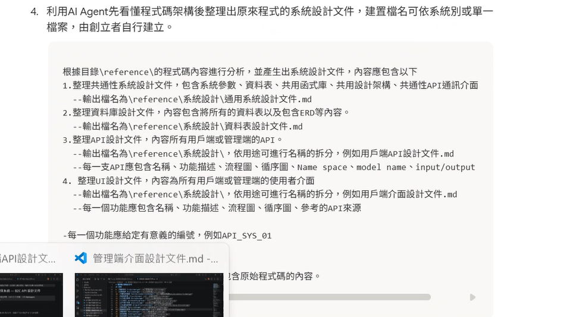

# A. 新專案

## process
1. DRAFT
2. PLAN
    - 使用 Plan skill 重新產生
3. requirements
    - notes, records, ...
    - notebook LM > 逐字稿
    - 拆分需求
4. sa
    - 需求代碼對照表.md
    - 非功能性需求(通用文件)
    - 需求拆分系統分析文件
5. sd
    - 對照產生sd文件
6. 整合測試
    - 產生測試計畫
7. 

## reference
- skills: https://github.com/anthropics/skills/blob/main/skills/doc-coauthoring/SKILL.md
- 透過 [skill-creator](https://github.com/anthropics/skills/tree/main/skills/skill-creator) 來產生 SKILL.md

# B. 舊專案逆向工程

## process
1. 系統分析文件 
    - 使用逆向skill

