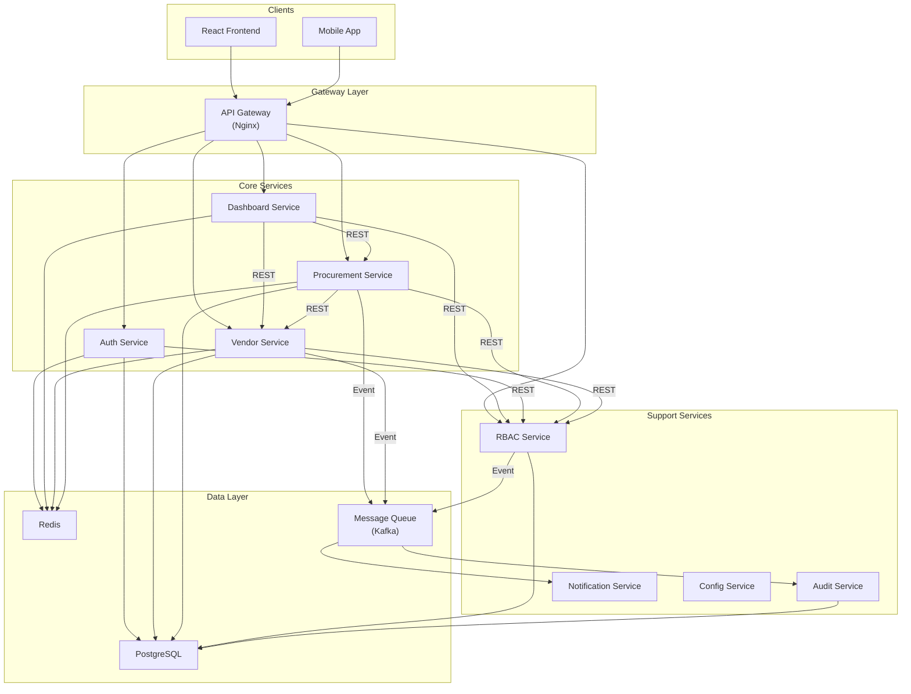

# 微服務分解和邊界設計

**文檔版本**: 1.0  
**編寫日期**: 2026-05-08  
**範圍**: LinkWise Phase 2 微服務架構設計  
**狀態**: 系統分析階段  

---

## 目錄

1. [概述](#概述)
2. [分層架構到微服務的映射](#分層架構到微服務的映射)
3. [8 個微服務的詳細設計](#8-個微服務的詳細設計)
4. [跨服務通信方案](#跨服務通信方案)
5. [數據分片策略](#數據分片策略)
6. [共享服務的微服務化](#共享服務的微服務化)
7. [微服務依賴關係圖](#微服務依賴關係圖)

---

## 概述

本文檔定義 LinkWise 微服務架構中 8 個微服務的邊界、職責、依賴關係和通信協議。

### 微服務設計原則

1. **單一職責原則 (Single Responsibility)**
   - 每個微服務負責一個獨立的業務能力
   - 例: Vendor Service 只負責供應商生命週期, 不負責採購流程

2. **高內聚, 低耦合**
   - 微服務內部的模塊高度相關
   - 微服務之間的依賴盡可能減少
   - 跨服務調用只在必要時進行

3. **康威定律 (Conway's Law)**
   - 微服務的邊界應該與團隊邊界對應
   - 每個微服務對應一個或半個開發團隊
   - 便於獨立開發和部署

4. **數據隔離**
   - 每個微服務管理自己的數據庫 (或共享庫的獨立模式)
   - 不允許直接跨越數據庫查詢
   - 通過 API 進行數據交互

5. **可獨立部署**
   - 微服務的升級不應影響其他服務
   - 需要版本相容性策略
   - 支持灰度發佈和回滾

---

## 分層架構到微服務的映射

### 當前 Phase 1 分層架構

```
┌─────────────────────────────────────────────────────┐
│ 表現層 (Presentation Layer)                         │
│ React 19 + TypeScript + Vite 6                      │
│ Pages: Dashboard, Vendor, PR, User Management       │
└─────────────────────────────────────────────────────┘
                        ↓
                   REST API
                        ↓
┌─────────────────────────────────────────────────────┐
│ 應用層 (Application Layer)                          │
│ Spring Boot Controllers                             │
│ - DashboardController, VendorController,            │
│   PurchaseRequestController, UserController, etc.   │
└─────────────────────────────────────────────────────┘
                        ↓
                  Service Interface
                        ↓
┌─────────────────────────────────────────────────────┐
│ 業務層 (Business Logic Layer)                       │
│ Service 類                                          │
│ - DashboardService, VendorService,                  │
│   PurchaseRequestService, UserService, etc.        │
│ 共享服務: AuthService, AuditService, 等             │
└─────────────────────────────────────────────────────┘
                        ↓
                Repository Interface
                        ↓
┌─────────────────────────────────────────────────────┐
│ 數據層 (Data Access Layer)                          │
│ Spring Data JPA Repository                          │
│ - VendorRepository, PurchaseRequestRepository, etc. │
└─────────────────────────────────────────────────────┘
                        ↓
                   JDBC / ORM
                        ↓
┌─────────────────────────────────────────────────────┐
│ 基礎設施層 (Infrastructure Layer)                   │
│ PostgreSQL 16, Redis, Elasticsearch                │
└─────────────────────────────────────────────────────┘
```

### 微服務架構映射

```
┌─────────────────────────────────────────────────────┐
│ API Gateway (Nginx / Spring Cloud Gateway)          │
│ - 路由、認證、速率限制、請求聚合                   │
└─────────────────────────────────────────────────────┘
     ↓        ↓         ↓         ↓        ↓
┌────────┐ ┌────────┐ ┌────────┐ ┌────────┐ ┌────────┐
│Dashboard│ │Auth    │ │Vendor  │ │Procure-│ │Audit   │
│Service  │ │Service │ │Service │ │ment    │ │Service │
│         │ │        │ │        │ │Service │ │        │
├────────┤ ├────────┤ ├────────┤ ├────────┤ ├────────┤
│App Layer│ │App Layer│ │App Layer│ │App Layer│ │App Layer│
│(REST)  │ │(REST)  │ │(REST)  │ │(REST)  │ │(REST)  │
│↓       │ │↓       │ │↓       │ │↓       │ │↓       │
│Service │ │Service │ │Service │ │Service │ │Service │
│Logic   │ │Logic   │ │Logic   │ │Logic   │ │Logic   │
│↓       │ │↓       │ │↓       │ │↓       │ │↓       │
│Data    │ │Data    │ │Data    │ │Data    │ │Data    │
│Layer   │ │Layer   │ │Layer   │ │Layer   │ │Layer   │
│        │ │        │ │        │ │        │ │        │
└────────┘ └────────┘ └────────┘ └────────┘ └────────┘
     ↓        ↓         ↓         ↓        ↓
    DB       DB        DB        DB       DB
   (Redis   (Auth    (Vendor   (PR/PO   (Audit
    /Cache) DB)      DB)       DB)      DB)

+ Notification Service, Config Service 等
```

### 映射規則

| 分層元素 | 單體架構 | 微服務架構 |
|--------|--------|----------|
| **表現層** | 單一 React App | 同上 (無變化) |
| **API 入口** | Spring Boot App 的 / (根路徑) | API Gateway (Nginx) + 各微服務的 /api/service |
| **Controller** | DashboardController → 單體 App | DashboardService 的 Controller |
| **Service** | 各種 Service 混在一起 | 按業務邊界分組到不同微服務 |
| **Repository** | 單一 PostgreSQL 數據庫 | 各微服務自己的數據庫 (或共享庫) |
| **Infrastructure** | 單一 Spring Boot 進程 | 多個獨立的 Spring Boot 進程 (容器化) |

---

## 8 個微服務的詳細設計

### 微服務列表

```
1️⃣  Dashboard Service   - 企業採購概覽和分析
2️⃣  Auth Service        - 身份驗證和授權
3️⃣  Vendor Service      - 供應商生命週期管理
4️⃣  Procurement Service - 採購流程 (PR/PO)
5️⃣  Audit Service       - 操作審計日誌
6️⃣  Notification Service - 通知和提醒
7️⃣  Config Service      - 配置管理中心
8️⃣  RBAC Service        - 組織、部門、角色、權限管理
```

---

### 1️⃣ Dashboard Service (儀表板微服務)

#### 職責

提供企業採購決策層的實時儀表板，展示關鍵指標和趨勢。

#### 核心功能

```
API 端點:
├─ GET /api/dashboard/summary
│  返回: {
│    monthly_spend: 1500000,
│    active_vendors: 45,
│    pending_prs: 12,
│    inventory_alerts: 3
│  }
├─ GET /api/dashboard/spend-trend?months=6
│  返回: [{month, total_spend}, ...]
├─ GET /api/dashboard/vendor-distribution
│  返回: [{vendor, spend, rating}, ...]
├─ GET /api/dashboard/pr-funnel
│  返回: {draft: 5, submitted: 10, approved: 50, converted: 100}
└─ GET /api/dashboard/recent-operations
   返回: [{operation, timestamp, user}, ...]
```

#### 內部結構

```
dashboard-service/
├─ src/
│  ├─ controller/
│  │  └─ DashboardController.java
│  ├─ service/
│  │  ├─ DashboardService.java
│  │  ├─ AggregationService.java (數據聚合)
│  │  └─ CacheService.java
│  ├─ client/
│  │  ├─ VendorServiceClient.java (調用 Vendor)
│  │  ├─ ProcurementServiceClient.java (調用 PR/PO)
│  │  └─ RbacServiceClient.java (調用權限)
│  ├─ entity/
│  │  ├─ DashboardMetric.java
│  │  └─ DashboardCache.java
│  └─ repository/
│     └─ MetricRepository.java
└─ resources/
   └─ application.yml
```

#### 依賴的微服務

| 依賴服務 | 調用方式 | 頻率 | 說明 |
|--------|--------|------|------|
| Vendor Service | REST (GET /api/vendors/summary) | 每頁面加載 1 次 | 獲取供應商統計 |
| Procurement Service | REST (GET /api/pr/statistics) | 每頁面加載 1 次 | 獲取 PR/PO 統計 |
| RBAC Service | REST (GET /api/rbac/user/{id}/org) | 首次登錄 | 檢查用戶權限 |
| Auth Service | JWT 令牌驗證 | 每個請求 | 驗證用戶身份 |
| Cache Service | Redis | 每個查詢 | 緩存聚合結果 (TTL=5 分鐘) |

#### 數據模型

```sql
-- Dashboard Metrics (本地快取表, 定期更新)
CREATE TABLE dashboard_metric (
    id UUID PRIMARY KEY,
    organization_id UUID NOT NULL,
    metric_type VARCHAR(50) NOT NULL,  -- 'SPEND', 'VENDOR_COUNT', etc.
    metric_value DECIMAL,
    period_date DATE NOT NULL,
    created_at TIMESTAMP,
    INDEX (organization_id, metric_type, period_date)
);

-- 數據來自遠程調用, 在本地快取
-- 只用於快速查詢, 不作為主要數據源
```

#### 通信協議

```
請求示例:
GET /api/dashboard/summary?organization_id=ORG-A
Authorization: Bearer <JWT_TOKEN>

響應:
{
  "monthly_spend": 1500000,
  "active_vendors": 45,
  "pending_prs": 12,
  "inventory_alerts": 3,
  "timestamp": "2026-05-08T10:30:00Z"
}

超時: 5 秒 (超時則返回緩存數據)
重試: 3 次 (指數退避)
熔斷: 失敗 5 次後打開, 30 秒後嘗試半開
```

#### 性能考慮

- 優先使用緩存 (Redis)
- 並發調用下游服務 (CompletableFuture)
- 如果下游服務超時, 返回過時緩存而不是完全失敗
- 實現 Batch API 減少調用次數

---

### 2️⃣ Auth Service (認證微服務)

#### 職責

統一的身份驗證、授權和會話管理。支持多種認證方式。

#### 核心功能

```
API 端點:
├─ POST /api/auth/login
│  請求: {email, password}
│  返回: {access_token, refresh_token, expires_in}
├─ POST /api/auth/oauth/google
│  請求: {code}  // Google OAuth code
│  返回: {access_token, ...}
├─ POST /api/auth/oauth/keycloak
│  請求: {code}  // Keycloak OAuth code
│  返回: {access_token, ...}
├─ GET /api/auth/verify
│  返回: {user_id, organization_id, roles}
├─ POST /api/auth/logout
│  清除 refresh token
├─ POST /api/auth/refresh
│  請求: {refresh_token}
│  返回: {access_token}
└─ GET /api/auth/user/{id}
   返回: {id, email, organization_id, roles}
```

#### 內部結構

```
auth-service/
├─ src/
│  ├─ controller/
│  │  ├─ AuthController.java
│  │  └─ OAuthController.java
│  ├─ service/
│  │  ├─ AuthService.java
│  │  ├─ JwtService.java (JWT 生成和驗證)
│  │  ├─ OAuthService.java
│  │  └─ PasswordService.java
│  ├─ entity/
│  │  ├─ User.java
│  │  └─ RefreshToken.java
│  └─ repository/
│     ├─ UserRepository.java
│     └─ RefreshTokenRepository.java
└─ resources/
   ├─ application.yml
   └─ keystore/ (JWT 簽名密鑰)
```

#### 依賴的微服務

| 依賴 | 說明 |
|------|------|
| RBAC Service | 驗證成功後調用 RBAC 獲取用戶的角色和權限 |
| Audit Service | 記錄登錄/登出事件 |
| 外部 OAuth Provider | Google OAuth, Keycloak |

#### 數據模型

```sql
CREATE TABLE auth_user (
    id UUID PRIMARY KEY,
    email VARCHAR(255) UNIQUE NOT NULL,
    password_hash VARCHAR(255),
    organization_id UUID NOT NULL,
    created_at TIMESTAMP,
    last_login TIMESTAMP,
    is_active BOOLEAN,
    INDEX (email, organization_id)
);

CREATE TABLE refresh_token (
    id UUID PRIMARY KEY,
    user_id UUID NOT NULL,
    token_hash VARCHAR(255),
    expires_at TIMESTAMP,
    created_at TIMESTAMP,
    INDEX (user_id, expires_at),
    FOREIGN KEY (user_id) REFERENCES auth_user(id)
);

-- OAuth 集成配置
CREATE TABLE oauth_provider (
    id UUID PRIMARY KEY,
    organization_id UUID NOT NULL,
    provider_type VARCHAR(50),  -- 'GOOGLE', 'KEYCLOAK'
    client_id VARCHAR(255),
    client_secret_encrypted VARCHAR(500),
    is_enabled BOOLEAN
);
```

#### JWT 令牌設計

```json
{
  "sub": "user-id-123",
  "email": "buyer@company.com",
  "organization_id": "ORG-A",
  "roles": ["BUYER", "APPROVER"],
  "iat": 1620000000,
  "exp": 1620003600,
  "iss": "linkwise-auth-service"
}
```

**令牌有效期**: 1 小時 (access token), 7 天 (refresh token)

#### 認證流程

```
用戶登錄:
1. 用戶輸入郵箱和密碼
2. Auth Service 驗證憑證
3. 如果正確, 生成 JWT (包含 user_id, organization_id, roles)
4. 返回 access_token 和 refresh_token
5. 前端存儲 token (localStorage 或 sessionStorage)

後續請求:
1. 前端在 Authorization 頭中發送 JWT
2. API Gateway 驗證 JWT 簽名
3. 或各微服務本地驗證 JWT
4. 如果 JWT 過期, 使用 refresh_token 獲取新的 access_token

好處:
- 無狀態認證 (不需要後端會話)
- Auth Service 宕機不影響已驗證用戶
- 支持多實例部署
```

---

### 3️⃣ Vendor Service (供應商微服務)

#### 職責

供應商生命週期管理、風險評級、績效追蹤、Onboarding 流程。

#### 核心功能

```
API 端點:
├─ GET /api/vendors (列表查詢, 支持過濾和分頁)
├─ GET /api/vendors/{id} (詳情)
├─ POST /api/vendors (創建)
├─ PUT /api/vendors/{id} (編輯)
├─ DELETE /api/vendors/{id} (軟刪除)
├─ GET /api/vendors/{id}/risk-score (風險評級)
├─ GET /api/vendors/{id}/performance (績效指標)
├─ GET /api/vendors/{id}/onboarding-status (Onboarding 進度)
├─ POST /api/vendors/{id}/onboarding/start (啟動 Onboarding)
├─ POST /api/vendors/{id}/onboarding/complete (完成 Onboarding)
└─ GET /api/vendors/summary (統計: 數量、分佈等)
```

#### 內部結構

```
vendor-service/
├─ src/
│  ├─ controller/
│  │  ├─ VendorController.java
│  │  ├─ RiskScoreController.java
│  │  ├─ OnboardingController.java
│  │  └─ PerformanceController.java
│  ├─ service/
│  │  ├─ VendorService.java
│  │  ├─ RiskScoreService.java (計算 4 維度聚合)
│  │  ├─ OnboardingService.java
│  │  ├─ PerformanceService.java
│  │  └─ WorkflowIntegration.java
│  ├─ entity/
│  │  ├─ Vendor.java
│  │  ├─ VendorRiskScore.java
│  │  ├─ VendorPerformance.java
│  │  └─ OnboardingTask.java
│  └─ repository/
│     ├─ VendorRepository.java
│     ├─ RiskScoreRepository.java
│     ├─ PerformanceRepository.java
│     └─ OnboardingRepository.java
└─ resources/
   └─ application.yml
```

#### 依賴的微服務

| 依賴服務 | 調用方式 | 說明 |
|--------|--------|------|
| Procurement Service | REST | 查詢供應商的訂單統計 (用於計算績效) |
| Workflow Service | REST/Event | 啟動 Onboarding 流程 |
| Audit Service | Event 或 REST | 記錄供應商變更 |
| Notification Service | Event/Queue | 發送 Onboarding 通知 |

#### 數據模型

```sql
CREATE TABLE vendor (
    id UUID PRIMARY KEY,
    organization_id UUID NOT NULL,
    name VARCHAR(255) NOT NULL,
    email VARCHAR(255),
    phone VARCHAR(20),
    address TEXT,
    registration_number VARCHAR(100),
    status VARCHAR(50),  -- PROSPECT, ACTIVE, DOWNGRADED, SUSPENDED
    created_at TIMESTAMP,
    updated_at TIMESTAMP,
    deleted_at TIMESTAMP,
    created_by UUID,
    updated_by UUID,
    INDEX (organization_id, status),
    INDEX (organization_id, created_at)
);

CREATE TABLE vendor_risk_score (
    id UUID PRIMARY KEY,
    vendor_id UUID NOT NULL,
    organization_id UUID NOT NULL,
    financial_score DECIMAL(5,2),  -- 40% 權重
    delivery_score DECIMAL(5,2),   -- 30% 權重
    quality_score DECIMAL(5,2),    -- 20% 權重
    compliance_score DECIMAL(5,2), -- 10% 權重
    overall_score DECIMAL(5,2),
    risk_level VARCHAR(20),  -- GREEN, YELLOW, RED
    calculated_at TIMESTAMP,
    INDEX (vendor_id, calculated_at),
    FOREIGN KEY (vendor_id) REFERENCES vendor(id)
);

CREATE TABLE vendor_performance (
    id UUID PRIMARY KEY,
    vendor_id UUID NOT NULL,
    organization_id UUID NOT NULL,
    on_time_delivery_rate DECIMAL(5,2),
    defect_rate DECIMAL(5,2),
    price_consistency DECIMAL(5,2),
    response_time DECIMAL(10,2),  -- 小時
    period_start DATE,
    period_end DATE,
    INDEX (vendor_id, period_end),
    FOREIGN KEY (vendor_id) REFERENCES vendor(id)
);

CREATE TABLE onboarding_task (
    id UUID PRIMARY KEY,
    vendor_id UUID NOT NULL,
    organization_id UUID NOT NULL,
    task_type VARCHAR(50),  -- 'KYC', 'COMPLIANCE', 'CONTRACT_SIGNING'
    status VARCHAR(50),     -- PENDING, COMPLETED, FAILED
    assigned_to UUID,
    due_date DATE,
    completed_at TIMESTAMP,
    INDEX (vendor_id, status)
);
```

#### 多租戶隔離

```sql
-- Vendor Service 的所有查詢都必須帶上 organization_id 過濾

-- ✅ 正確
SELECT * FROM vendor 
WHERE organization_id = $1 AND status = 'ACTIVE'

-- ❌ 錯誤 (會洩露其他租戶的數據)
SELECT * FROM vendor WHERE status = 'ACTIVE'

-- 在 Repository 層強制執行
class VendorRepository {
  @Query("SELECT v FROM Vendor v WHERE v.organizationId = :orgId")
  List<Vendor> findByOrganizationId(@Param("orgId") UUID orgId);
  
  // 禁止使用 findAll() 等無過濾的方法
}
```

---

### 4️⃣ Procurement Service (採購微服務)

#### 職責

採購流程的全生命週期管理 (PR 創建 → 審批 → PO → 收貨)。

#### 核心功能

```
API 端點:
├─ GET /api/pr (PR 列表)
├─ GET /api/pr/{id} (PR 詳情)
├─ POST /api/pr (創建 PR)
├─ PUT /api/pr/{id} (編輯 PR)
├─ POST /api/pr/{id}/submit (提交審批)
├─ GET /api/pr/{id}/approvals (審批歷史)
│
├─ GET /api/po (PO 列表)
├─ GET /api/po/{id} (PO 詳情)
├─ POST /api/pr/{pr_id}/convert-to-po (PR 轉 PO)
├─ PUT /api/po/{id} (編輯 PO)
│
├─ GET /api/receipt (收貨記錄)
├─ POST /api/po/{po_id}/receipt (創建收貨單)
├─ PUT /api/receipt/{id} (編輯收貨)
│
├─ GET /api/procurement/statistics (統計數據)
└─ GET /api/procurement/analytics (分析報表)
```

#### 內部結構

```
procurement-service/
├─ src/
│  ├─ controller/
│  │  ├─ PrController.java
│  │  ├─ PoController.java
│  │  ├─ ReceiptController.java
│  │  └─ AnalyticsController.java
│  ├─ service/
│  │  ├─ PrService.java
│  │  ├─ PoService.java
│  │  ├─ ReceiptService.java
│  │  ├─ ApprovalService.java (審批邏輯)
│  │  ├─ WorkflowService.java
│  │  ├─ ConversionService.java (PR→PO 轉換)
│  │  └─ ReconciliationService.java (對賬)
│  ├─ saga/
│  │  ├─ PrToPoSaga.java (PR 轉 PO 的 Saga 編排)
│  │  └─ ReceiptSaga.java
│  ├─ entity/
│  │  ├─ PurchaseRequest.java
│  │  ├─ PurchaseOrder.java
│  │  ├─ Receipt.java
│  │  ├─ Approval.java
│  │  └─ ProcurementHistory.java
│  └─ repository/
│     ├─ PrRepository.java
│     ├─ PoRepository.java
│     ├─ ApprovalRepository.java
│     └─ ReceiptRepository.java
└─ resources/
   ├─ application.yml
   └─ saga/ (Saga 定義配置)
```

#### 依賴的微服務

| 依賴服務 | 調用方式 | 說明 |
|--------|--------|------|
| Vendor Service | REST | 驗證供應商狀態, 計算風險 |
| RBAC Service | REST | 檢查審批人和權限 |
| Workflow Service | REST/Event | 啟動審批流程 |
| Audit Service | Event/Queue | 記錄所有操作 |
| Notification Service | Event/Queue | 發送審批通知 |
| Financial Service | REST (未來) | 預算凍結和釋放 |

#### 數據模型 (簡化版)

```sql
CREATE TABLE purchase_request (
    id UUID PRIMARY KEY,
    organization_id UUID NOT NULL,
    requester_id UUID NOT NULL,
    department_id UUID,
    vendor_id UUID,
    status VARCHAR(50),  -- DRAFT, SUBMITTED, APPROVED, REJECTED, CONVERTED_TO_PO
    title VARCHAR(255),
    description TEXT,
    total_amount DECIMAL(15,2),
    currency VARCHAR(3),
    created_at TIMESTAMP,
    updated_at TIMESTAMP,
    submitted_at TIMESTAMP,
    created_by UUID,
    updated_by UUID,
    INDEX (organization_id, status, created_at)
);

CREATE TABLE purchase_order (
    id UUID PRIMARY KEY,
    organization_id UUID NOT NULL,
    pr_id UUID NOT NULL,
    vendor_id UUID NOT NULL,
    status VARCHAR(50),  -- ISSUED, ACKNOWLEDGED, PARTIALLY_RECEIVED, FULLY_RECEIVED
    po_number VARCHAR(50),
    total_amount DECIMAL(15,2),
    issued_date DATE,
    due_date DATE,
    created_at TIMESTAMP,
    created_by UUID,
    INDEX (organization_id, vendor_id, status),
    FOREIGN KEY (pr_id) REFERENCES purchase_request(id)
);

CREATE TABLE approval (
    id UUID PRIMARY KEY,
    pr_id UUID NOT NULL,
    organization_id UUID NOT NULL,
    approver_id UUID NOT NULL,
    status VARCHAR(50),  -- PENDING, APPROVED, REJECTED, TRANSFERRED
    comment TEXT,
    created_at TIMESTAMP,
    updated_at TIMESTAMP,
    approved_at TIMESTAMP,
    INDEX (pr_id, status)
);

CREATE TABLE pr_history (
    id UUID PRIMARY KEY,
    pr_id UUID NOT NULL,
    action VARCHAR(50),  -- 'CREATED', 'SUBMITTED', 'APPROVED', 'REJECTED'
    changed_by UUID,
    changed_at TIMESTAMP,
    details JSONB,
    INDEX (pr_id, changed_at)
);
```

#### 分布式事務: PR → PO 轉換 (Saga 模式)

```
Saga 定義 (Orchestration 模式):

PR 轉 PO 流程:
┌─────────────────────────────────────────────────────┐
│ 1. Procurement Service (Saga Orchestrator)          │
│    開始: checkPrReadyForConversion()                │
│    ✓ PR 狀態必須是 APPROVED                         │
│    ✓ Vendor 必須是 ACTIVE                           │
└─────────────────────────────────────────────────────┘
         │
         ↓
┌─────────────────────────────────────────────────────┐
│ 2. 調用 Vendor Service                               │
│    validateVendorStatus(vendor_id, org_id)         │
│    ✓ 返回供應商狀態, 風險等級                       │
│    如果失敗 → 補償: 拒絕 PR                         │
└─────────────────────────────────────────────────────┘
         │
         ↓
┌─────────────────────────────────────────────────────┐
│ 3. 調用 RBAC Service                                 │
│    validateApprovers(pr.approvers, org_id)         │
│    ✓ 返回審批人信息                                 │
│    如果失敗 → 補償: 拒絕 PR                         │
└─────────────────────────────────────────────────────┘
         │
         ↓
┌─────────────────────────────────────────────────────┐
│ 4. 本地創建 PO                                       │
│    createPurchaseOrder(pr_data)                    │
│    ✓ 新建 PO 記錄                                   │
│    ✓ PR 狀態變更為 CONVERTED_TO_PO                  │
│    如果失敗 → 不需要補償 (本地事務)                 │
└─────────────────────────────────────────────────────┘
         │
         ↓
┌─────────────────────────────────────────────────────┐
│ 5. 發佈事件 (異步)                                   │
│    發佈: PO_CREATED 事件                            │
│    消費者: Audit Service, Notification Service     │
│    如果發佈失敗 → 重試直到成功 (Message Queue)      │
└─────────────────────────────────────────────────────┘
         │
         ↓
┌─────────────────────────────────────────────────────┐
│ 返回給前端: {po_id, status: 'ISSUED'}              │
└─────────────────────────────────────────────────────┘
```

#### 幂等性設計

```java
// 前端每次調用生成唯一的 Idempotency Key
POST /api/pr
Header: Idempotency-Key: 550e8400-e29b-41d4-a716-446655440000

// Procurement Service 使用該 Key 去重
@PostMapping("/pr")
public ResponseEntity<PR> createPR(
    @RequestBody CreatePRRequest request,
    @RequestHeader("Idempotency-Key") String idempotencyKey) {
  
  // 檢查是否已存在該 Key 對應的 PR
  PR existingPR = prRepository.findByIdempotencyKey(idempotencyKey);
  if (existingPR != null) {
    return ResponseEntity.ok(existingPR);  // 冪等返回
  }
  
  // 首次調用, 創建 PR
  PR newPR = prService.createPR(request);
  newPR.setIdempotencyKey(idempotencyKey);
  prRepository.save(newPR);
  
  return ResponseEntity.status(201).body(newPR);
}
```

---

### 5️⃣ Audit Service (審計微服務)

#### 職責

記錄所有跨服務操作的審計日誌, 支持合規性審計。

#### 核心功能

```
API 端點:
├─ POST /api/audit/log (記錄審計事件)
├─ GET /api/audit/logs (查詢審計日誌)
├─ GET /api/audit/logs/{id} (日誌詳情)
├─ GET /api/audit/entity/{entity_type}/{entity_id} (實體變更歷史)
├─ GET /api/audit/user/{user_id}/activities (用戶活動)
├─ POST /api/audit/export (導出審計報告)
└─ GET /api/audit/compliance-report (合規報告)
```

#### 內部結構

```
audit-service/
├─ src/
│  ├─ controller/
│  │  ├─ AuditController.java
│  │  └─ ComplianceController.java
│  ├─ service/
│  │  ├─ AuditService.java (同步寫入)
│  │  ├─ AsyncAuditService.java (非同步消費)
│  │  ├─ ComplianceService.java
│  │  └─ ReportService.java
│  ├─ entity/
│  │  ├─ AuditLog.java
│  │  └─ ChangeHistory.java
│  ├─ repository/
│  │  ├─ AuditLogRepository.java
│  │  └─ ChangeHistoryRepository.java
│  ├─ event/
│  │  ├─ AuditEventListener.java
│  │  └─ AuditEventConsumer.java (Kafka 消費者)
│  └─ queue/
│     └─ AuditMessageHandler.java
└─ resources/
   └─ application.yml
```

#### 依賴的微服務

| 依賴 | 說明 |
|------|------|
| Message Queue (Kafka/RabbitMQ) | 從所有服務接收審計事件 |
| 無直接依賴 | Audit Service 不調用其他服務 |

#### 數據模型

```sql
CREATE TABLE audit_log (
    id UUID PRIMARY KEY,
    organization_id UUID NOT NULL,
    user_id UUID NOT NULL,
    action VARCHAR(100),  -- 'CREATE_PR', 'APPROVE_PR', 'UPDATE_VENDOR'
    entity_type VARCHAR(50),  -- 'PR', 'VENDOR', 'USER'
    entity_id UUID,
    old_value JSONB,  -- 變更前的值
    new_value JSONB,  -- 變更後的值
    change_summary TEXT,
    timestamp TIMESTAMP NOT NULL,
    ip_address VARCHAR(45),
    user_agent TEXT,
    INDEX (organization_id, timestamp),
    INDEX (entity_type, entity_id),
    INDEX (user_id, timestamp)
);

CREATE TABLE change_history (
    id UUID PRIMARY KEY,
    organization_id UUID NOT NULL,
    entity_type VARCHAR(50),
    entity_id UUID,
    audit_log_id UUID,
    version INT,
    changed_fields JSONB,  -- {field: {old: x, new: y}}
    changed_at TIMESTAMP,
    changed_by UUID,
    INDEX (entity_type, entity_id, changed_at)
);

-- 特殊表: 敏感操作審計 (加強保護)
CREATE TABLE sensitive_action_audit (
    id UUID PRIMARY KEY,
    organization_id UUID NOT NULL,
    action VARCHAR(100),
    actor_user_id UUID,
    target_user_id UUID,
    action_timestamp TIMESTAMP,
    verification_token_hash VARCHAR(255),  -- 用於不可抵賴
    INDEX (organization_id, action_timestamp)
);
```

#### 審計事件格式 (統一)

```json
{
  "auditId": "550e8400-e29b-41d4-a716-446655440000",
  "organizationId": "ORG-A",
  "userId": "U-001",
  "action": "CREATE_PR",
  "entityType": "PR",
  "entityId": "PR-001",
  "timestamp": "2026-05-08T10:30:00Z",
  "sourceService": "procurement-service",
  "sourceVersion": "1.0.0",
  "details": {
    "oldValue": null,
    "newValue": {
      "id": "PR-001",
      "title": "Buy equipment",
      "amount": 50000
    },
    "changeFields": ["title", "amount"]
  },
  "ipAddress": "192.168.1.100",
  "userAgent": "Mozilla/5.0..."
}
```

#### 非同步消費流程

```
各微服務 (Procurement, Vendor, RBAC, etc.)
         ↓
發佈事件到 Message Queue (Kafka Topic: "audit-events")
         ↓
Audit Service 消費
         ↓
異步寫入 audit_log 表
         ↓
異步更新 change_history 表
         ↓
異步構建索引用於快速查詢
         ↓
如果審計隊列堆積, 告警 (吞吐量不足)
```

#### 合規性檢查

```
Audit Service 會定期檢查:
1. 所有敏感操作是否都有審計記錄
2. 審計日誌的完整性 (沒有被篡改)
3. 審計日誌的存儲安全 (加密)
4. 用戶數據變更的可追溯性

不可抵賴特性:
- 使用數字簽名保證日誌不可篡改
- 關鍵操作需要多人驗證 (管理員簽名)
- 敏感操作記錄額外的驗證信息
```

---

### 6️⃣ Notification Service (通知微服務)

#### 職責

發送各種通知 (郵件、短信、App 推送)。

#### 核心功能

```
API 端點:
├─ POST /api/notifications/send (同步發送)
├─ POST /api/notifications/schedule (延遲發送)
├─ GET /api/notifications/history (發送歷史)
├─ POST /api/notifications/preferences (用戶偏好設置)
└─ GET /api/notifications/status/{id} (發送狀態)
```

#### 消費事件

```
Message Queue (Kafka) 主題:
├─ pr-submitted-event → 發送審批通知給審批人
├─ pr-approved-event → 發送批准通知給申請人
├─ po-issued-event → 發送訂單通知給供應商
├─ vendor-onboarded-event → 發送歡迎信給新供應商
├─ receipt-completed-event → 發送收貨確認
└─ risk-alert-event → 發送風險告警
```

#### 內部結構

```
notification-service/
├─ src/
│  ├─ controller/
│  │  ├─ NotificationController.java
│  │  └─ PreferencesController.java
│  ├─ service/
│  │  ├─ NotificationService.java (同步)
│  │  ├─ AsyncNotificationService.java (非同步)
│  │  ├─ EmailService.java
│  │  ├─ SmsService.java
│  │  ├─ PushNotificationService.java
│  │  └─ RetryService.java (重試邏輯)
│  ├─ consumer/
│  │  ├─ EventConsumer.java (Kafka 消費者)
│  │  └─ EventRouter.java (路由不同事件)
│  ├─ entity/
│  │  ├─ Notification.java
│  │  ├─ NotificationPreference.java
│  │  └─ NotificationTemplate.java
│  └─ repository/
│     └─ NotificationRepository.java
└─ resources/
   ├─ templates/ (郵件模板)
   └─ application.yml
```

#### 可靠性保證

```
"至少一次交付" 語義:

1. 發件方 (Procurement Service) 發佈事件到 Kafka
   Topic: "pr-approved-event"
   Partition: 決定消息順序 (按 organization_id)
   Replication: 3 副本 (確保不丟失)

2. Notification Service 消費
   Group: "notification-service"
   重試策略: 指數退避 (1s, 2s, 4s, 8s, ... 最多 5 次)

3. 如果發送失敗 (如郵件服務不可用)
   → 消息保留在隊列中
   → 等待服務恢復後重試

4. 死信隊列 (DLQ)
   → 如果消息在 5 次重試後仍失敗
   → 移入死信隊列用於人工處理

5. 冪等發送
   → 使用 Idempotency Key (message_id)
   → 即使重複消費, 也只發送一次
   → 查詢: SELECT * FROM notification WHERE external_message_id = ?
```

#### 數據模型

```sql
CREATE TABLE notification (
    id UUID PRIMARY KEY,
    organization_id UUID NOT NULL,
    recipient_email VARCHAR(255),
    recipient_id UUID,
    notification_type VARCHAR(50),  -- 'PR_APPROVAL', 'PO_ISSUED', etc.
    subject VARCHAR(255),
    content TEXT,
    status VARCHAR(50),  -- 'PENDING', 'SENT', 'FAILED', 'BOUNCED'
    sent_at TIMESTAMP,
    failed_reason TEXT,
    retry_count INT,
    external_message_id VARCHAR(255),  -- 用於去重
    created_at TIMESTAMP,
    INDEX (organization_id, created_at),
    INDEX (external_message_id)
);

CREATE TABLE notification_preference (
    id UUID PRIMARY KEY,
    user_id UUID NOT NULL,
    organization_id UUID NOT NULL,
    notification_type VARCHAR(50),
    channel VARCHAR(50),  -- 'EMAIL', 'SMS', 'PUSH'
    is_enabled BOOLEAN,
    created_at TIMESTAMP
);
```

---

### 7️⃣ Config Service (配置中心)

#### 職責

集中管理應用配置, 支持動態更新。

#### 核心功能

```
API 端點:
├─ GET /api/config/{service_name} (獲取服務配置)
├─ GET /api/config/{service_name}/{key} (獲取單個配置)
├─ PUT /api/config/{service_name}/{key} (更新配置)
├─ POST /api/config/publish (發佈配置變更)
└─ GET /api/config/audit-trail (配置變更歷史)
```

#### 數據模型

```sql
CREATE TABLE config_property (
    id UUID PRIMARY KEY,
    service_name VARCHAR(100),  -- 'dashboard-service', 'vendor-service', etc.
    property_key VARCHAR(255),
    property_value TEXT,
    data_type VARCHAR(50),  -- 'STRING', 'INT', 'BOOLEAN', 'JSON'
    description TEXT,
    version INT,
    is_active BOOLEAN,
    updated_at TIMESTAMP,
    updated_by UUID,
    INDEX (service_name, property_key)
);

CREATE TABLE config_audit (
    id UUID PRIMARY KEY,
    service_name VARCHAR(100),
    property_key VARCHAR(255),
    old_value TEXT,
    new_value TEXT,
    changed_by UUID,
    changed_at TIMESTAMP,
    reason TEXT
);
```

#### 配置推送機制

```
1. 管理員在 Config Service 中更新配置
2. Config Service 發佈事件: "CONFIG_CHANGED"
3. 各微服務訂閱該事件:
   a) 接收事件
   b) 從 Config Service 拉取新配置
   c) 更新內存配置 (或重新載入 Bean)
   d) 驗證新配置是否有效
   e) 如果無效, 回滾到舊配置並告警

最大延遲: 30 秒內所有服務都應該看到新配置
```

---

### 8️⃣ RBAC Service (角色權限微服務)

#### 職責

組織結構、用戶、角色、權限管理。

#### 核心功能

```
API 端點:
├─ 組織管理
│  ├─ GET /api/organizations (列表)
│  └─ GET /api/organizations/{id} (詳情)
├─ 部門管理
│  ├─ GET /api/departments (按組織)
│  ├─ POST /api/departments
│  └─ PUT /api/departments/{id}
├─ 用戶管理
│  ├─ GET /api/users (按組織)
│  ├─ POST /api/users
│  ├─ PUT /api/users/{id}
│  └─ DELETE /api/users/{id}
├─ 角色管理
│  ├─ GET /api/roles (內置 + 自定義)
│  ├─ POST /api/roles
│  └─ PUT /api/roles/{id}
├─ 權限管理
│  ├─ GET /api/permissions
│  └─ POST /api/roles/{id}/assign-permission
└─ 授權檢查
   ├─ GET /api/rbac/check-permission (檢查用戶權限)
   └─ GET /api/rbac/user/{id}/roles
```

#### 內部結構

```
rbac-service/
├─ src/
│  ├─ controller/
│  │  ├─ OrganizationController.java
│  │  ├─ DepartmentController.java
│  │  ├─ UserController.java
│  │  ├─ RoleController.java
│  │  ├─ PermissionController.java
│  │  └─ AuthorizationController.java
│  ├─ service/
│  │  ├─ OrganizationService.java
│  │  ├─ UserService.java
│  │  ├─ RoleService.java
│  │  ├─ PermissionService.java
│  │  └─ AuthorizationService.java (授權檢查)
│  ├─ entity/
│  │  ├─ Organization.java
│  │  ├─ Department.java
│  │  ├─ User.java
│  │  ├─ Role.java
│  │  ├─ Permission.java
│  │  └─ UserRole.java (中間表)
│  └─ repository/
│     ├─ UserRepository.java
│     ├─ RoleRepository.java
│     └─ PermissionRepository.java
└─ resources/
   └─ application.yml
```

#### 權限模型

```
內置角色 (4 個):
├─ Admin - 系統管理員
│  ├─ 管理所有用戶和角色
│  ├─ 查看所有採購數據
│  └─ 系統設置
├─ Approver - 審批人
│  ├─ 審批 PR
│  ├─ 查看部門/企業報表
│  └─ 管理部門供應商
├─ Buyer - 採購人員
│  ├─ 創建/編輯 PR
│  ├─ 查詢供應商
│  └─ 提交訂單
└─ Requester - 業務部門員工
   ├─ 創建 PR 請求
   └─ 查詢訂單狀態

自定義角色: 企業可以定義自己的角色組合

權限檢查流程:
1. 用戶發起操作 (如 "修改供應商")
2. API Gateway 或 Service 調用 RBAC Service
3. RBAC 檢查: user → roles → permissions
4. 返回: {allowed: true/false, reason: ""}
5. 如果不允許, 返回 403 Forbidden
```

#### 多租戶隔離

```
RBAC Service 中的多租戶隔離:

1. 用戶只能管理自己組織的數據
2. 每個查詢都帶上 organization_id
3. 跨租戶的用戶權限檢查必須驗證 organization_id

示例:
// ✓ 正確: 檢查用戶 U1 在 ORG-A 中的角色
SELECT r.* FROM user_role ur
JOIN role r ON ur.role_id = r.id
WHERE ur.user_id = 'U1' 
  AND ur.organization_id = 'ORG-A'

// ✗ 錯誤: 沒有 organization_id 過濾
SELECT r.* FROM user_role ur
JOIN role r ON ur.role_id = r.id
WHERE ur.user_id = 'U1'
// 可能返回 U1 在其他組織的角色!
```

---

## 跨服務通信方案

### 通信模式決策矩陣

| 場景 | 同步 (REST/gRPC) | 非同步 (Event/Queue) | 推薦 |
|------|----------------|------------------|------|
| **實時性要求高** (如查詢供應商) | ✓ 即時返回結果 | ✗ 有延遲 | 同步 |
| **業務流程編排** (如 PR→PO 轉換) | ✓ 容易協調 | ~ 複雜但解耦 | 同步 + 事件 |
| **通知和告警** | ✗ 會阻塞 | ✓ 不阻塞 | 非同步 |
| **審計日誌** | ✗ 會阻塞 | ✓ 不阻塞 | 非同步 |
| **獨立性要求高** (服務故障隔離) | ✗ 級聯故障 | ✓ 隔離 | 非同步 |
| **一致性要求高** (資金操作) | ✓ ACID 事務 | ~ 最終一致性 | 同步 |

### 同步通信 (REST)

#### 場景 1: Dashboard 查詢供應商統計

```
GET /api/dashboard/summary?organization_id=ORG-A

Dashboard Service (同步調用):
1. 調用 GET /api/vendors/summary?org_id=ORG-A
   → Vendor Service 在 10-20ms 內返回結果
   
2. 如果 Vendor Service 超時 (> 5 秒)
   → 返回緩存數據
   → 記錄告警 "Vendor Service 超時"

3. 如果 Vendor Service 故障 (熔斷器打開)
   → 使用最近一次成功的緩存結果
   → 前端展示 "數據可能過時, 最後更新時間: ..."
```

#### REST API 設計規範

```
統一的請求/響應格式:

REQUEST:
GET /api/vendors?organization_id=ORG-A&page=1&limit=10&sort=created_at:desc

RESPONSE (200 OK):
{
  "code": "SUCCESS",
  "message": "Operation successful",
  "data": {
    "items": [
      {
        "id": "V-001",
        "name": "Supplier A",
        "status": "ACTIVE",
        "riskLevel": "GREEN"
      }
    ],
    "pagination": {
      "page": 1,
      "limit": 10,
      "total": 100
    }
  },
  "timestamp": "2026-05-08T10:30:00Z"
}

ERROR (400 / 403 / 500):
{
  "code": "INVALID_REQUEST",
  "message": "Invalid organization_id: must be UUID",
  "errors": [
    {
      "field": "organization_id",
      "message": "Invalid UUID format"
    }
  ]
}
```

#### 超時和重試策略

```java
@RestTemplate bean 配置:
ConnectionTimeout: 3 秒
ReadTimeout: 5 秒
重試策略: 指數退避, 最多 3 次

Procurement Service 調用 Vendor Service 時:
try {
  response = restTemplate.getForObject(
    "http://vendor-service/api/vendors/{id}",
    Vendor.class,
    vendorId
  );
} catch (ResourceAccessException e) {
  // 超時或連接錯誤
  if (retryCount < 3) {
    wait(Math.pow(2, retryCount) * 100);  // 100ms, 200ms, 400ms
    return retry();
  } else {
    // 所有重試都失敗
    throw new VendorServiceUnavailableException();
  }
}
```

### 非同步通信 (Message Queue)

#### 場景 1: PO 創建後通知相關服務

```
同步部分:
1. Procurement Service 創建 PO (本地事務)
2. 返回成功給前端

非同步部分:
3. Procurement Service 發佈 "PO_CREATED" 事件到 Kafka
4. Audit Service 消費, 記錄審計日誌
5. Notification Service 消費, 發送郵件通知
6. Dashboard Service 消費, 更新緩存

優點:
- PO 創建不阻塞通知發送
- 即使 Notification Service 故障, PO 仍然被創建
- 各服務獨立處理, 解耦合
```

#### 事件格式定義

```json
{
  "eventId": "550e8400-e29b-41d4-a716-446655440000",
  "eventType": "PO_CREATED",
  "version": "1.0",
  "timestamp": "2026-05-08T10:30:00Z",
  "sourceService": "procurement-service",
  "sourceVersion": "1.0.0",
  "organizationId": "ORG-A",
  "userId": "U-001",
  "data": {
    "poId": "PO-001",
    "prId": "PR-001",
    "vendorId": "V-001",
    "amount": 50000,
    "currency": "USD",
    "issuedDate": "2026-05-08"
  }
}
```

#### Message Queue 配置

```
Kafka Topic: "procurement-events"
Partition Key: organization_id (確保同一企業的事件順序)
Replication Factor: 3 (確保高可用)
Retention: 7 天 (審計溯源需要)

Consumer Groups:
├─ "audit-service" - 消費所有事件記錄審計
├─ "notification-service" - 消費特定事件發送通知
├─ "dashboard-service" - 消費統計事件更新緩存
└─ "analytics-service" - 消費用於分析

消費保證:
- 至少一次交付 (at-least-once delivery)
- 消費者需要實現幂等邏輯
- 使用 offsets 追蹤消費進度
```

### 混合通信 (同步 + 非同步)

#### 場景: PR 審批流程

```
同步部分 (實時決策):
1. 用戶提交 PR
2. Procurement Service 同步調用 RBAC Service 獲取下一級審批人
3. Procurement Service 同步調用 Vendor Service 驗證供應商
4. 返回結果給前端 (如果下一級審批人缺失 → 顯示錯誤)

非同步部分 (後續處理):
5. Procurement Service 發佈 "PR_SUBMITTED" 事件
6. Notification Service 異步發送審批邀請郵件給審批人
7. Audit Service 異步記錄提交審計日誌
8. Dashboard Service 異步更新待處理 PR 計數

優點:
- 決策層同步 (確保數據一致性)
- 通知層非同步 (不阻塞主流程)
- 兩全其美
```

---

## 數據分片策略

### Phase 2.0 (初期): 保持單庫多租戶

#### 架構

```
所有微服務 → PostgreSQL 單庫 (multi-tenant mode)
        ↓
每個表都有 organization_id 字段
每個查詢都帶 WHERE organization_id = ?
```

#### 優點

- 简单易維護
- 支持 PostgreSQL RLS (Row-Level Security)
- 支持全局事務
- 支持複雜查詢 (JOIN、子查詢)
- 資料庫成本最低

#### 缺點

- 無法獨立擴展 (一個租戶的流量可能拖累其他租戶)
- 難以實現租戶特定的優化
- 單庫故障影響所有租戶

#### 何時轉換到分庫

當滿足以下任何條件時:
- 單庫 QPS > 10,000 (單個數據庫無法支撑)
- 特定租戶的數據量 > 100GB (表空間管理困難)
- 特定租戶需要特殊的性能要求或數據位置要求
- 預計 5 年內達到上述條件

### Phase 2.1 (試點): 選擇性分庫

#### 分庫候選

```
低優先級 (可以分庫):
├─ Vendor Service (VMS) - 數據相對獨立
├─ Audit Service - 只增不改, 易於分庫

保持共享庫:
├─ RBAC Service - 需要跨查詢
├─ Config Service - 配置量小

策略:
Phase 2.1 → 實驗性分庫 Vendor Service + Audit Service
           保持其他服務在共享庫
           驗證分庫的可行性和複雜度

如果成功 → Phase 2.2 考慮分庫 Procurement Service
         (因為 PR/PO 是核心業務, 要謹慎)
```

#### 分庫鍵選擇

```
主分片鍵: organization_id

// ✓ 正確: 按 organization_id 分庫
Vendor Service 數據庫名: vendor_service_db
表分區: 按 organization_id 分區 (或每個租戶獨立表)

// ✗ 不推薦: 按其他鍵分庫
// 因為會導致 organization_id 的跨庫查詢複雜度爆炸
```

#### 分庫架構

```
Procurement Service → 共享 PostgreSQL (主庫)
   ↓
   包含: organization, user, vendor_ref, pr, po, approval, receipt

Vendor Service → 獨立 PostgreSQL (分庫)
   ↓
   包含: vendor, vendor_risk_score, vendor_performance, onboarding_task

Audit Service → 獨立 PostgreSQL (分庫)
   ↓
   包含: audit_log, change_history

Redis (跨所有服務):
   ├─ Cache: dashboard_metrics, vendor_summary
   ├─ Session: auth 令牌
   └─ Rate Limiting: API 速率限制
```

### Phase 2.2 (完全分庫): 租戶隔離最大化

#### 架構

```
組織 ORG-A:
├─ PostgreSQL 實例 (ORG-A 專用)
├─ Redis 實例 (ORG-A 專用)
└─ 所有微服務都使用該實例

組織 ORG-B:
├─ PostgreSQL 實例 (ORG-B 專用)
├─ Redis 實例 (ORG-B 專用)
└─ 所有微服務都使用該實例

Tenant Router:
Incoming Request → Lookup organization_id → Route to ORG's Database
```

#### 複雜性

- 每個新租戶需要創建新的數據庫實例
- 需要租戶路由層
- 需要跨租戶查詢複雜性的管理
- 備份和恢復變得複雜

#### 何時採用

- 租戶規模很大 (> 100GB 數據)
- 租戶對隔離有特殊要求 (合規性、數據位置)
- 租戶願意為獨佔實例付費

---

## 共享服務的微服務化

### Auth Service 的遷移計劃

#### 當前 (Phase 1):

```
單體應用內的 AuthService:
├─ 驗證用戶憑證
├─ 生成 Session 並存儲在 Redis
├─ 每個請求檢查 Session
└─ Session 存儲在進程內存或 Redis
```

#### 遷移 (Phase 2):

```
獨立的 Auth Service:
├─ REST 端點: POST /api/auth/login
├─ 生成 JWT 令牌 (不是 Session)
├─ 返回 JWT
└─ 後續請求使用 JWT 驗證 (無狀態)

好處:
- 無狀態, 易於水平擴展
- Auth Service 宕機不影響已認證用戶
- 不需要共享的 Session 存儲

挑戰:
- JWT 令牌撤銷延遲 (無法立即刪除用戶)
  解決: 維護黑名單 (Redis), 但規模有限
- 需要修改前端代碼使用 JWT
```

### Audit Service 的分布式日誌設計

#### 當前 (Phase 1):

```
同步寫入 audit_log 表:
每個操作 → 同步寫入 → 返回結果 (延遲 ≈ 1-5ms)
```

#### 遷移 (Phase 2):

```
非同步寫入 + 本地緩存:

Step 1: 本地緩存日誌 (Ring Buffer)
        ↓
Step 2: 異步批量發佈到 Kafka
        ↓
Step 3: Audit Service 異步消費並寫入數據庫

優點:
- 操作不被審計日誌阻塞 (提升性能)
- 支持高吞吐量 (1000+ 日誌/秒)

缺點:
- 日誌有延遲 (通常 1-5 秒)
- 需要確保不丟失 (Kafka 副本)

實施:
1. 在 Audit SDK 中實現 Ring Buffer (非同步化)
2. 周期性批量發送到 Kafka (100ms 或 100 條消息)
3. Audit Service 消費並寫入 PostgreSQL
4. 監控消費延遲, 如果 > 10 秒則告警
```

### Workflow Engine 的分布式編排

#### 當前 (Phase 1):

```
Workflow 在單一進程內運行:
状态機存儲在內存或數據庫
立即執行下一步驟
```

#### 遷移 (Phase 2):

```
分布式 Workflow (需要特殊考慮):

選項 A: 使用開源工作流引擎 (Temporal, Temporal.io)
  優點: 可靠性高, 故障恢復好
  缺點: 學習曲線陡, 需要新增組件
  時間: 2-3 個月集成

選項 B: 在 Procurement Service 內實現 Saga 模式
  優點: 簡單, 足以支持採購流程
  缺點: 只能處理線性流程, 複雜分支困難
  時間: 1-2 週實現

推薦: 先用 Option B (Saga 模式) 支持採購流程
      後期如果需要複雜工作流 (如 Onboarding) 再考慮 Option A
```

---

## 微服務依賴關係圖

### 靜態依賴圖



### 依賴強度表

| 源 → 目標 | 類型 | 頻率 | 延遲容限 | 故障影響 |
|----------|------|------|--------|--------|
| Dashboard → Vendor | REST | 高 | 低 (5s) | 儀表板加載變慢 |
| Dashboard → Procurement | REST | 高 | 低 (5s) | 儀表板加載變慢 |
| Procurement → Vendor | REST | 中 | 中 (10s) | PR 審批延遲 |
| Procurement → RBAC | REST | 中 | 中 (10s) | PR 審批失敗 |
| Auth → RBAC | REST | 中 | 中 (10s) | 登錄延遲 |
| All → Audit | Event | 低 | 高 (分鐘級) | 審計延遲 |
| All → Notification | Event | 低 | 高 (分鐘級) | 通知延遲 |

### 故障影響分析

```
如果 Vendor Service 故障:
├─ 直接依賴: Dashboard, Procurement
├─ 級聯影響: 
│  ├─ Dashboard 無法加載供應商統計
│  ├─ Procurement 無法驗證供應商, PR 審批受阻
│  └─ 用戶無法進行任何涉及供應商的操作
└─ 緩解:
   ├─ Vendor Service 使用 Redis 快取
   ├─ 所有調用方使用熔斷器 (快速失敗)
   ├─ 前端顯示 "供應商信息暫不可用"
   └─ Vendor Service 優先級設置為最高 (SLA 99.99%)

如果 Auth Service 故障:
├─ 新登錄無法進行 (无法生成 JWT)
├─ 但已登錄的用戶可以繼續操作 (因為使用 JWT)
├─ 影響: 新用戶無法進入系統
└─ 緩解:
   ├─ Auth Service 部署多個實例
   ├─ 使用 Redis 快取已驗證的用戶
   ├─ JWT 驗證由各服務本地進行 (無需調用 Auth)

如果 Audit Service 故障:
├─ 審計日誌寫入延遲
├─ 但業務操作本身不受影響 (非同步)
├─ 影響: 無法進行實時審計查詢 (延遲會積累)
└─ 緩解: 業務操作繼續, 日誌保存在隊列中
```

---

## 總結

本文檔定義了 LinkWise 微服務架構的 8 個核心微服務, 明確了：

1. **每個微服務的職責和邊界** (Single Responsibility Principle)
2. **服務間的通信方式** (同步 REST vs 非同步 Event)
3. **數據隔離和多租戶策略** (保持 organization_id 隔離)
4. **分布式事務模式** (Saga Pattern 用於複雜流程)
5. **依賴關係和故障影響** (用於設計容錯機制)

核心設計決策：

- **Phase 2.0**: 保持單庫多租戶 (簡單, 安全)
- **Phase 2.1**: 試點分庫 Vendor + Audit Service (驗證可行性)
- **Phase 2.2**: 完全微服務 (所有服務獨立)

下一步: 根據本文檔進行實施規劃和開發任務分解。

